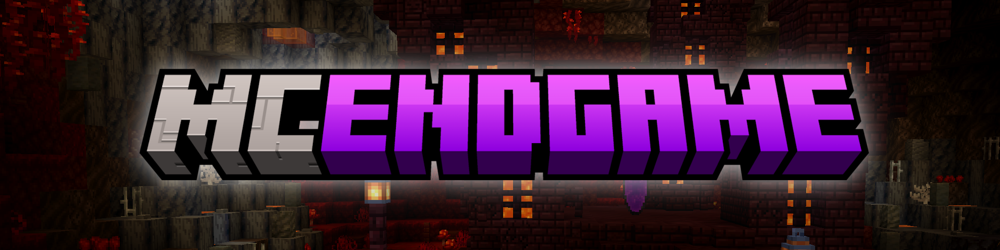
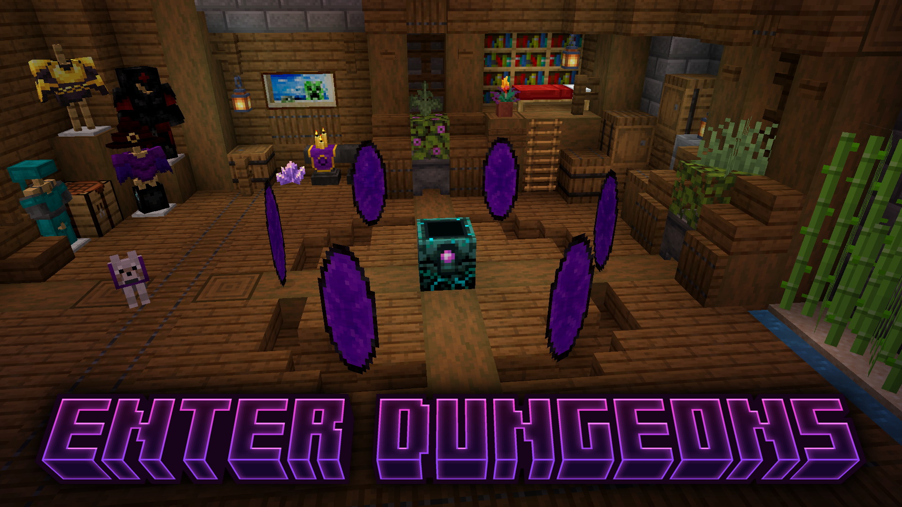
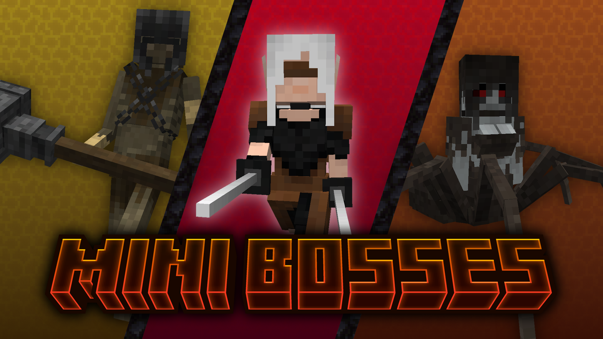
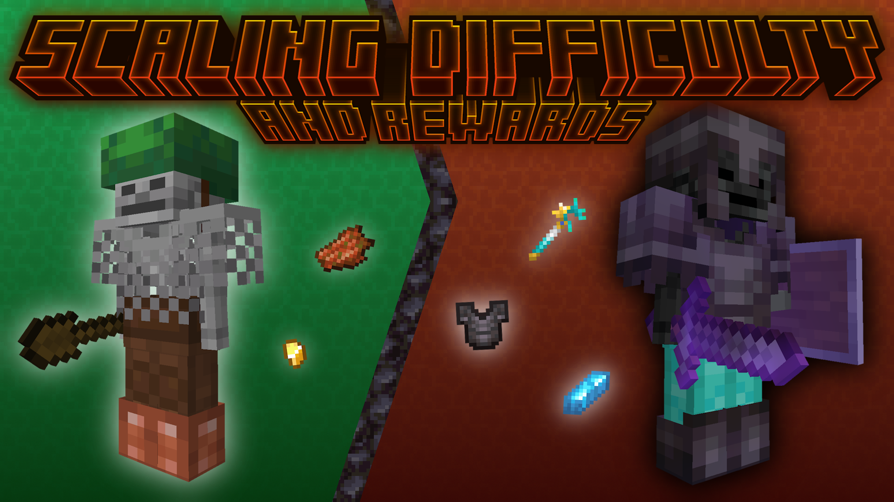
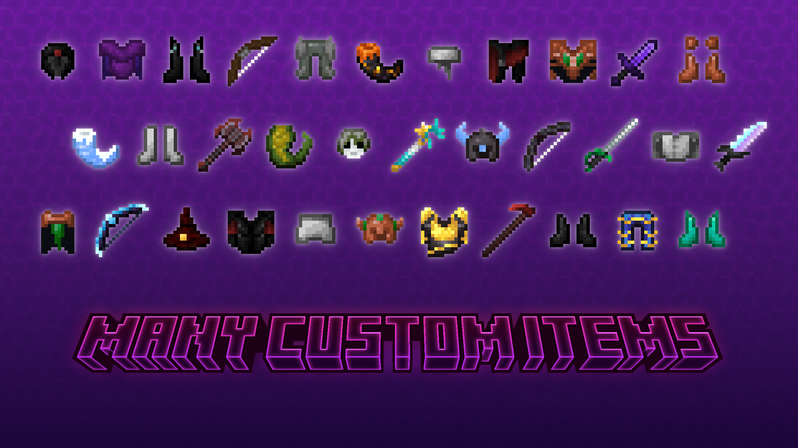
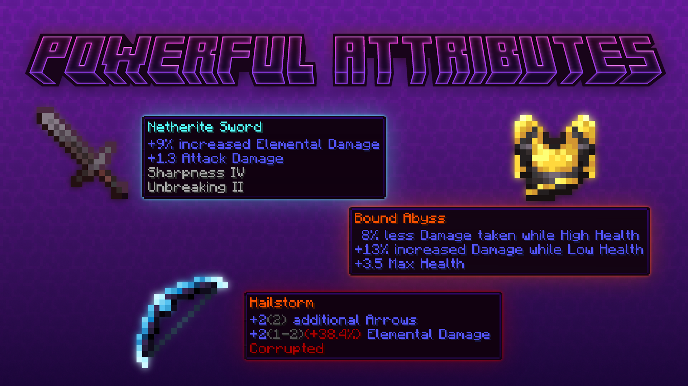
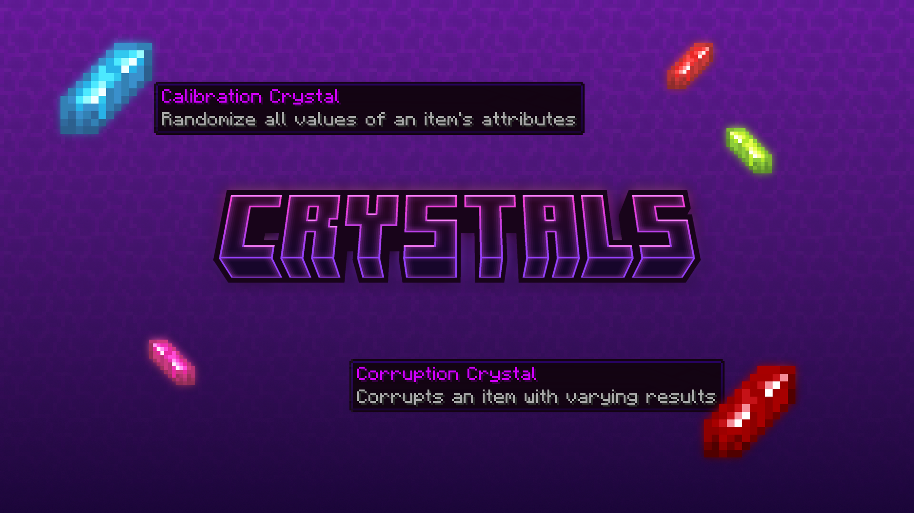
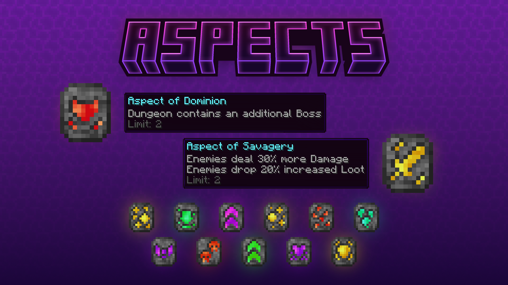
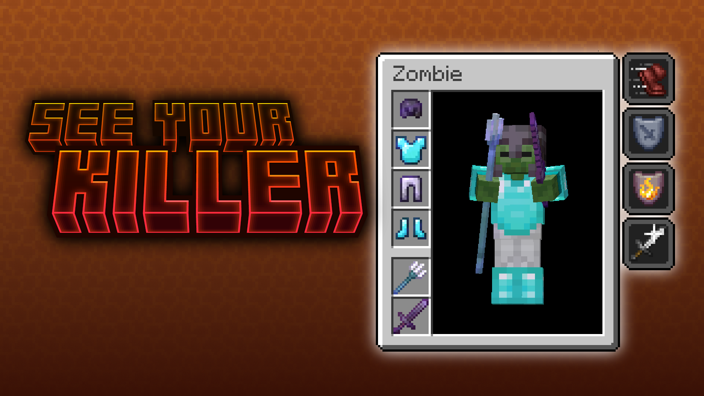

[](https://www.minecraft.net/)
[](https://fabricmc.net/use/installer/)
[](https://modrinth.com/mod/mcendgame)
[](https://www.curseforge.com/minecraft/mc-mods/mcendgame)
[](https://github.com/maucon/MCEndgame-fabric/actions/workflows/build.yml)
[](LICENSE)

<div align="center">
  

  <p align="center">
    <a href="https://modrinth.com/mod/mcendgame">Get it on Modrinth</a>
    &middot;
    <a href="https://www.curseforge.com/minecraft/mc-mods/mcendgame">Get it on CurseForge</a>
    &middot;
    <a href="https://github.com/maucon/MCEndgame-fabric/issues/new?labels=bug&template=bug-report.md">Report Bug</a>
    &middot;
    <a href="https://github.com/maucon/MCEndgame-fabric/issues/new?labels=enhancement&template=feature-request.md">Request Feature</a>
  </p>
</div>

<br>

## About The Project

**MCEndgame** is a Minecraft Fabric mod that enhances the endgame experience by introducing new layers of progression, challenging dungeons, powerful custom gear, and a deep itemization
system.

### Features

- Procedurally generated **dungeons** with adaptive difficulty scaling
- **Boss** fights featuring unique AI, attack patterns, and animations
- Custom-designed **armor sets**
- **Unique equipment** with special effects and custom attributes
- Dedicated **custom attribute system**
- **Totem** slots that grant attributes active within dungeons
- **Crystals** for additional gear modification, usable via the **Crystal Forge**
- **Aspects** that alter and enhance the dungeon experience

### Commands

- `/dungeonfilter` – Configure which item types will not be picked up when in a dungeon
- `/killer` – See the equipment and status effects of your latest killer
- `/totems` – Manage your currently equipped totems
- `/giveunique` (Moderator) – Generate a unique item with custom rolls
- `/dungeonlevel` (Moderator) – Set the current dungeon level and progress of a player
- `/givetotem` (Moderator) – Generate a specific totem

### Gallery

<details>
    <summary>Dungeon Device</summary>
    
</details>
<details>
    <summary>Bosses</summary>
    
</details>
<details>
    <summary>Scaling Difficulty</summary>
    
</details>
<details>
    <summary>Custom Items</summary>
    
</details>
<details>
    <summary>Custom Attribute System</summary>
    
</details>
<details>
    <summary>Crystals</summary>
    
</details>
<details>
    <summary>Aspects</summary>
    
</details>
<details>
    <summary>Killer</summary>
    
</details>

---

## Getting Started

### Installation

1. Install [Fabric Loader](https://fabricmc.net/use/) for Minecraft **1.21.11**
2. Download [Fabric API](https://modrinth.com/mod/fabric-api)
3. Download MCEndgame from [Releases](https://github.com/maucon/MCEndgame-fabric/releases), [Modrinth](https://modrinth.com/mod/mcendgame/)
   or [CurseForge](https://www.curseforge.com/minecraft/mc-mods/mcendgame)
4. Download all [required dependencies](#dependencies)
5. Place all `.jar` files into your mods folder
6. Launch the game

### Dependencies

| Dependency                                                                | Version                |
|---------------------------------------------------------------------------|------------------------|
| [Fabric Loader](https://fabricmc.net/use/)                                | ≥ 0.18.4               |
| [Fabric API](https://modrinth.com/mod/fabric-api)                         | ~0.141.3+1.21.11       |
| [Fabric Language Kotlin](https://modrinth.com/mod/fabric-language-kotlin) | ~1.13.11+kotlin.2.3.21 |
| [Fantasy](https://github.com/NucleoidMC/fantasy)                          | ~0.7.0+1.21.11         |
| [Geckolib](https://modrinth.com/mod/geckolib)                             | ~5.4.4                 |

### Building from Source

You can also build the mod yourself:

```bash
git clone https://github.com/maucon/MCEndgame-fabric.git
cd MCEndgame-fabric
./gradlew build
```

The built mod `.jar` will be in `build/libs/`.
> Note: Building the project requires a valid GitHub token with `read:packages` permission, provided via the `GITHUB_PACKAGES_TOKEN` environment variable, along with your GitHub username set
> in `GITHUB_PACKAGES_NAME`.

---

## Contributing

If you have a feature request or found a bug, please open an issue. If you'd like to contribute a fix or improvement, feel free to fork the repository and submit a pull request.

1. Fork the Project
2. Create your Feature Branch (`git checkout -b feature/AmazingFeature`)
3. Commit your Changes (`git commit -m 'Add some AmazingFeature'`)
4. Push to the Branch (`git push origin feature/AmazingFeature`)
5. Open a Pull Request

## License

This project is licensed under the MIT License. See the [LICENSE](LICENSE) file for details.

## Contact

Should you have any questions or encounter any difficulties, please don't hesitate to open an issue or join the `Discussions` section.

## Acknowledgments

* [FabricMC](https://fabricmc.net/)
* [Geckolib](https://modrinth.com/mod/geckolib/versions)
* [NucleoidMC/fantasy](https://github.com/NucleoidMC/fantasy)
* [Path of Exile](https://www.pathofexile.com/)
* [Best README Template](https://github.com/othneildrew/Best-README-Template)
